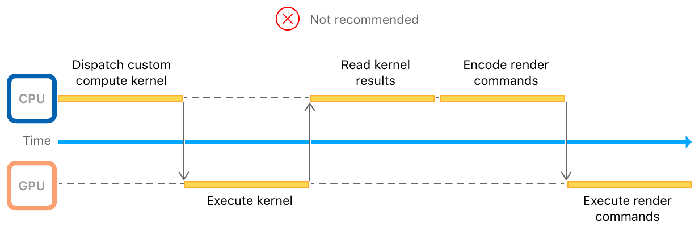

# Encoding Indirect Command Buffers on the GPU

Maximize CPU to GPU parallelization by generating render commands on the GPU.

## Overview

This sample app demonstrates how to use *indirect command buffers* (ICB) to issue rendering instructions from the GPU. When you have a rendering algorithm that runs in a compute kernel, use ICBs to generate draw calls based on your algorithm's results. This sample app uses a compute kernel to cull invisible objects from its rendering submission, thereby generating draw commands for only the objects that are currently visible in the scene. 


Without ICBs, you couldn't submit rendering commands on the GPU. Instead, the CPU would wait for your compute kernel's results before generating rendering commands. Then, the GPU would wait for the rendering commands to make it across the CPU to GPU bridge, which amounts to a round trip slow path as seen in the following diagram:  



The [Encoding Indirect Command Buffers on the CPU](https://developer.apple.com/documentation/metal/advanced_command_setup/encoding_indirect_command_buffers_on_the_cpu) sample code introduces ICBs by creating a single ICB to reuse its commands every frame. So, while the former sample saved expensive command encoding time by reusing commands, this sample uses ICBs to effect a GPU-driven rendering pipeline. 

## Getting Started

This project contains targets for macOS and iOS. Run the iOS scheme on a physical device because Metal isn't supported in the simulator.

## Define the Data Read by the ICB

Ideally, you store each mesh in its own buffer but on iOS, kernels running on the GPU are limited to a small number of data buffers they can access per execution. To reduce the number of buffers needed during the ICBs execution, you pack all meshes into a single buffer at varying offsets. Then, use another buffer to store the offset and size of each mesh. The process to do this follows. 

At initialization, create the data for each mesh:

``` objective-c
for(int objectIdx = 0; objectIdx < AAPLNumObjects; objectIdx++)
{
    // Choose the parameters to generate a mesh so that each one is unique.
    uint32_t numTeeth = random() % 50 + 3;
    float innerRatio = 0.2 + (random() / (1.0 * RAND_MAX)) * 0.7;
    float toothWidth = 0.1 + (random() / (1.0 * RAND_MAX)) * 0.4;
    float toothSlope = (random() / (1.0 * RAND_MAX)) * 0.2;

    // Create a vertex buffer and initialize it with a unique 2D gear mesh.
    tempMeshes[objectIdx] = [self newGearMeshWithNumTeeth:numTeeth
                                               innerRatio:innerRatio
                                               toothWidth:toothWidth
                                               toothSlope:toothSlope];
}
```

Count the individual and accumulated mesh sizes and create the container buffer: 

``` objective-c
size_t bufferSize = 0;

for(int objectIdx = 0; objectIdx < AAPLNumObjects; objectIdx++)
{
    size_t meshSize = sizeof(AAPLVertex) * tempMeshes[objectIdx].numVerts;
    bufferSize += meshSize;
}

_vertexBuffer = [_device newBufferWithLength:bufferSize options:0];
```

Finally, insert each mesh into the container buffer while noting its offset and size in the second buffer: 

``` objective-c
for(int objectIdx = 0; objectIdx < AAPLNumObjects; objectIdx++)
{
    // Store the mesh metadata in the `params` buffer.

    params[objectIdx].numVertices = tempMeshes[objectIdx].numVerts;

    size_t meshSize = sizeof(AAPLVertex) * tempMeshes[objectIdx].numVerts;

    params[objectIdx].startVertex = currentStartVertex;

    // Pack the current mesh data in the combined vertex buffer.

    AAPLVertex* meshStartAddress = ((AAPLVertex*)_vertexBuffer.contents) + currentStartVertex;

    memcpy(meshStartAddress, tempMeshes[objectIdx].vertices, meshSize);

    currentStartVertex += tempMeshes[objectIdx].numVerts;

    free(tempMeshes[objectIdx].vertices);

    // Set the other culling and mesh rendering parameters.

    // Set the position of each object to a unique space in a grid.
    vector_float2 gridPos = (vector_float2){objectIdx % AAPLGridWidth, objectIdx / AAPLGridWidth};
    params[objectIdx].position = gridPos * AAPLObjecDistance;

    params[objectIdx].boundingRadius = AAPLObjectSize / 2.0;
}
```

## Update the Data Read by the ICB Dynamically

The important techniques shown by this sample not only include issuing draw calls from the GPU, but responding to runtime conditions to execute a select set of draws. By culling non-visible vertices out of the data being fed through the rendering pipeline, you save significant rendering time and effort. To do that, use the same compute kernel that encodes the ICB's commands to continually update the ICB's data buffers:  

``` metal
// Check whether the object at 'objectIndex' is visible and set draw parameters if so.
//  Otherwise, reset the command so that nothing is done.
kernel void
cullMeshesAndEncodeCommands(uint                          objectIndex   [[ thread_position_in_grid ]],
                            constant AAPLFrameState      *frame_state   [[ buffer(AAPLKernelBufferIndexFrameState) ]],
                            device AAPLObjectPerameters  *object_params [[ buffer(AAPLKernelBufferIndexObjectParams)]],
                            device AAPLVertex            *vertices      [[ buffer(AAPLKernelBufferIndexVertices) ]],
                            device ICBContainer          *icb_container [[ buffer(AAPLKernelBufferIndexCommandBufferContainer) ]])
{
    float2 worldObjectPostion  = frame_state->translation + object_params[objectIndex].position;
    float2 clipObjectPosition  = frame_state->aspectScale * AAPLViewScale * worldObjectPostion;

    const float rightBounds =  1.0;
    const float leftBounds  = -1.0;
    const float upperBounds =  1.0;
    const float lowerBounds = -1.0;

    bool visible = true;

    // Set the bounding radius in view space.
    const float2 boundingRadius = frame_state->aspectScale * AAPLViewScale * object_params[objectIndex].boundingRadius;

    // Check if the object's bounding circle has moved outside of the view bounds.
    if(clipObjectPosition.x + boundingRadius.x < leftBounds  ||
       clipObjectPosition.x - boundingRadius.x > rightBounds ||
       clipObjectPosition.y + boundingRadius.y < lowerBounds ||
       clipObjectPosition.y - boundingRadius.y > upperBounds)
    {
        visible = false;
    }
    
    // Get an indirect render commnd object from the ICB given the object's unique index.
    render_command cmd(icb_container->commandBuffer, objectIndex);

    if(visible)
    {
        // Set the buffers and add draw command.
        cmd.set_vertex_buffer(frame_state, AAPLVertexBufferIndexFrameState);
        cmd.set_vertex_buffer(object_params, AAPLVertexBufferIndexObjectParams);
        cmd.set_vertex_buffer(vertices, AAPLVertexBufferIndexVertices);

        cmd.draw_primitives(primitive_type::triangle,
                            object_params[objectIndex].startVertex,
                            object_params[objectIndex].numVertices, 1,
                            objectIndex);
    }
    else
    {
        // Generate an empty command so that the GPU doesn't draw this object.
        cmd.reset();
    }
}
```

The parallel nature of the GPU partitions the compute task for you, resulting in multiple offscreen meshes getting culled concurrently.

## Pass an ICB to a Compute Kernel Using an Argument Buffer

To get an ICB on the GPU and make it accessible to a compute kernel, you pass it through an argument buffer, as follows:  

Define the container argument buffer. It's a struct that contains one member, the ICB:   

``` metal
// This is the argument buffer that contains the ICB.
typedef struct ICBContainer
{
    command_buffer commandBuffer [[ id(AAPLArgumentBufferIDCommandBuffer) ]];
} ICBContainer;
```

Encode the ICB into the argument buffer: 

``` objective-c
id<MTLArgumentEncoder> argumentEncoder =
    [GPUCommandEncodingKernel newArgumentEncoderWithBufferIndex:AAPLKernelBufferIndexCommandBufferContainer];

_icbArgumentBuffer = [_device newBufferWithLength:argumentEncoder.encodedLength
                                       options:MTLResourceStorageModeShared];

[argumentEncoder setArgumentBuffer:_icbArgumentBuffer offset:0];

[argumentEncoder setIndirectCommandBuffer:_indirectCommandBuffer
                                  atIndex:AAPLArgumentBufferIDCommandBuffer];
```

Pass the ICB (`_indirectCommandBuffer`) to the kernel by setting the argument buffer on to the kernel's compute command encoder: 

``` objective-c
[computeEncoder setBuffer:_icbArgumentBuffer offset:0 atIndex:AAPLKernelBufferIndexCommandBufferContainer];
```

Because the ICB is passed through an argument buffer, standard argument buffer rules apply. Call `useResource` on the ICB to tell Metal to prepare its use:

``` objective-c
[computeEncoder useResource:_indirectCommandBuffer usage:MTLResourceUsageWrite];
```

## Encode and Optimize ICB Commands

Encode the ICB's commands by dispatching the compute kernel: 

``` objective-c
[computeEncoder dispatchThreads:MTLSizeMake(AAPLNumObjects, 1, 1)
          threadsPerThreadgroup:MTLSizeMake(threadExecutionWidth, 1, 1)];
```

Optimize your ICB commands to remove empty commands or redundant state by calling `optimizeIndirectCommandBuffer:withRange:`:

``` objective-c
[blitEncoder optimizeIndirectCommandBuffer:_indirectCommandBuffer
                                 withRange:NSMakeRange(0, AAPLNumObjects)];
```

This sample optimizes because redundant state results from the kernel setting a buffer for each draw, and encoding empty commands for each invisible object. Optimizing out the empty commands frees up a significant number of blank spaces in the command buffer that Metal would otherwise spend time skipping at runtime. 

- Note: If you optimize an indirect command buffer, you won't be able to call `executeCommandsInBuffer:withRange:` with a range that starts in the optimized region. Instead, specify a range that starts at the beginning of the optimized region and finishes at the end or within the optimized region.

## Execute the ICB

Draw the onscreen meshes by calling `executeCommandsInBuffer` on your render command encoder: 

``` objective-c
[renderEncoder executeCommandsInBuffer:_indirectCommandBuffer withRange:NSMakeRange(0, AAPLNumObjects)];
```

While you can encode an ICB's commands in a compute kernel, you call `executeCommandsInBuffer` from your host app to encode a single command that contains all of the commands the compute kernel encoded. By doing this, you choose the queue and buffer that the ICB's commands go into. The time that you call `executeIndirectCommandBuffer` determines the placement of the ICB's commands among any other commands you may also encode in the same buffer.
